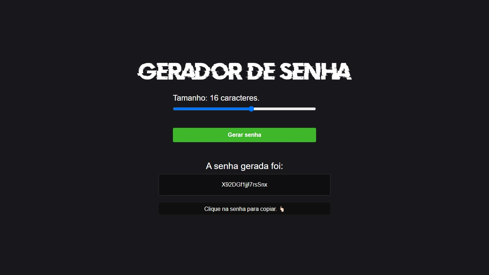

# Password Generator

> Tela inicial do aplicativo "Gerador de Senha" que permite ao usuário a criação uma senha aleatória.

---

## ⚙️ Funcionalidade

- [x] Defina o número de caracteres, entre 5 e 25, para criação da senha através do seletor:
  - Clique no botão "Gerar Senha"
  - A senha gerada será exibira em um campo abaixo
  -  Ao clicar na senha que foi gerada, é possível salvá-la
  - Atualize a página para gerar uma nova senha

---

## 💻 Tecnologias utilizadas

* HTML
* CSS
* Javascript

---
## 🔗 Acesse o aplicativo

https://newestpasswordgenerator.netlify.app/

---

## 👨🏻‍💻 Desenvolvedor

<!--Idealizador do projeto:-->

<table>
  <tr>
    <td align="center">
      <a href="#">
         
        
          <b>Sergio Cardoso</b>
        
      </a>
    </td>
    
  </tr>
</table>

## 📝 Licença

Esse projeto está sob licença. Veja o arquivo [LICENÇA](LICENSE.md) para mais detalhes.

[⬆ Voltar ao topo](#password-generator) 

